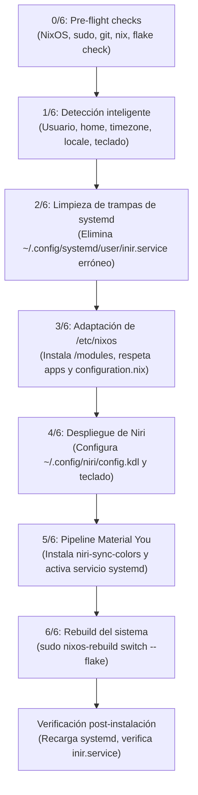

<div align="center">

# ❄️ iNiR on NixOS

<p>
  <b><a href="README.md">English</a></b> |
  <b>Español</b>
</p>

[](#-aviso-de-estado-experimental)
[](https://nixos.org)
[](https://github.com/YaLTeR/niri)
[](https://nixos.wiki/wiki/Flakes)
[](https://github.com/snowarch/iNiR)
[](https://github.com/snowarch/iNiR)


### Guía modular reproducible e instalador automatizado para ejecutar [iNiR](https://github.com/snowarch/iNiR) sobre el compositor Wayland Niri en NixOS con Flakes.

</div>

---

> [!WARNING]
> ### ⚠️ AVISO DE ESTADO EXPERIMENTAL
> Este proyecto y su script de instalación automatizado (`install.sh`) se encuentran en **fase experimental**.
> - El instalador está diseñado para ser **no destructivo** y genera copias de seguridad con marca de tiempo (`.bak.<timestamp>`) de cualquier archivo que modifique.
> - Se adapta a tu configuración existente de NixOS sin borrar tus programas ni usuarios, pero se aconseja ejecutar `./install.sh --dry-run` antes de aplicar cambios en sistemas de producción.

---

## 📑 Tabla de Contenidos

- [¿Cómo funciona el instalador automatizado? (`install.sh`)](#-cómo-funciona-el-script-de-instalación-installsh)
  - [Fases de ejecución paso a paso](#fases-de-ejecución-paso-a-paso)
  - [Opciones del instalador](#opciones-del-instalador)
- [Adaptación a la configuración del usuario](#-adaptación-a-la-configuración-del-usuario)
  - [Opciones modulares configurables](#opciones-modulares-configurables)
  - [Gestión de audio y escritorio](#gestión-de-audio-y-escritorio)
- [Estructura del Repositorio](#-estructura-del-repositorio--qué-va-en-dónde)
- [Instalación Rápida](#-instalación-rápida)
  - [Opción A — Instalador Automatizado (Recomendada)](#opción-a--instalador-automatizado-recomendada)
  - [Opción B — Instalación Manual](#opción-b--instalación-manual-paso-a-paso)
- [Sincronización de Color (Material You ↔ Niri)](#-sincronización-de-color-niri--fondo-de-pantalla)
- [Atajos de Teclado de Niri](#-atajos-de-teclado-en-niri)
- [Verificación y Diagnóstico](#-verificación-post-instalación)
- [Actualizaciones y Rollbacks](#-actualizaciones)
- [Solución de Problemas Conocidos](#-problemas-conocidos-y-soluciones)

---

## 🛠️ ¿Cómo funciona el script de instalación (`install.sh`)?

El instalador `install.sh` automatiza la configuración de forma reproducible, declarativa y segura mediante 7 fases consecutivas (de la 0 a la 6):



### Fases de ejecución paso a paso:

1. **Fase 0/6 — Comprobaciones iniciales (Pre-flight):**
   - Comprueba que el sistema sea NixOS (`/etc/nixos` presente).
   - Valida la disponibilidad de herramientas base de instalación: `git`, `nix` y `sudo`.
   - *Nota:* No requiere herramientas de usuario como `inotifywait` o `jq` antes de reconstruir el sistema, ya que los propios módulos de NixOS las instalarán.
   - Ejecuta `nix flake check` en el repositorio para validar la sintaxis antes de tocar cualquier archivo.

2. **Fase 1/6 — Detección inteligente del entorno del usuario:**
   - Detecta el usuario objetivo de forma precisa (si se invoca con `sudo`, localiza a `$SUDO_USER` y su directorio `$HOME` para no escribir en `/root`).
   - Lee el nombre de host (`hostname`), la zona horaria (`timedatectl`), el locale (`localectl`) y la distribución de teclado (`X11 Layout`).
   - Si ya existe `/etc/nixos/configuration.nix`, lee los valores configurados en tu archivo para mantener consistencia exacta.
   - Permite al usuario confirmar o personalizar interactivamente los valores detectados.

3. **Fase 2/6 — Limpieza de servicios obsoletos y trampas de systemd:**
   - **Solución al gotcha #1:** `inir doctor` suele generar un archivo estático en `~/.config/systemd/user/inir.service`. Este archivo tiene mayor prioridad que el servicio declarativo de NixOS en `/etc/systemd/user/`, impidiendo que las actualizaciones de Nix surtan efecto de forma invisible. El instalador detecta y elimina este archivo conflictivo.
   - Limpia servicios obsoletos o heredados de versiones anteriores (`niri-color-sync.service`, `xwayland-satellite.service`, scripts de actualización antiguos).

4. **Fase 3/6 — Adaptación de la configuración del sistema (`/etc/nixos`):**
   - Crea un respaldo con timestamp de `/etc/nixos/modules` e instala los módulos limpios.
   - **Si ya tienes `/etc/nixos/configuration.nix`:**
     - Realiza una copia de seguridad (`configuration.nix.bak.<timestamp>`).
     - **Conserva todos tus paquetes, programas, discos y usuarios existentes.**
     - Inyecta únicamente `./modules` en tu bloque `imports = [ ... ]`.
     - Verifica si tu usuario tiene asignados los grupos `video` e `i2c` (requeridos para el brillo de pantalla externa con `ddcutil`).
   - **Si es una instalación limpia:**
     - Despliega la plantilla de referencia sustituyendo tu usuario, hostname, zona horaria y locale detectados.
   - **Adaptación del Flake:**
     - Si ya tienes `/etc/nixos/flake.nix`, verifica que contenga la entrada de `snowarch/inir`. Si falta, te muestra la sintaxis exacta para integrarlo.
     - Si no tienes `flake.nix`, instala la plantilla oficial de referencia adaptada a tu hostname.

5. **Fase 4/6 — Configuración del compositor Niri:**
   - Realiza copia de seguridad de `~/.config/niri/config.kdl` si ya existía.
   - Copia la configuración optimizada de Niri y adapta la regla de teclados (`xkb { layout "..." }`) a la distribución detectada en tu equipo.

6. **Fase 5/6 — Sincronización de colores Material You:**
   - Instala el binario `niri-sync-colors` en `~/.local/bin/`.
   - Instala y habilita el daemon de usuario `niri-sync-colors.service` para sincronizar los bordes y temas cada vez que cambies el fondo de pantalla con <kbd>Mod</kbd> + <kbd>W</kbd>.

7. **Fase 6/6 — Aplicación declarativa (`nixos-rebuild switch`):**
   - Detecta automáticamente el target del flake (`/etc/nixos#<hostname>` o `/etc/nixos`).
   - Ejecuta la compilación con logs completos en `/tmp/inir-nixos-install-<fecha>.log`.
   - Recarga el gestor de systemd del usuario y comprueba que `inir.service` y `niri-sync-colors.service` queden activos.

---

### Opciones del instalador

| Opción | Descripción |
|---|---|
| `./install.sh` | Instalación guiada e interactiva con confirmaciones en cada paso crítico. |
| `./install.sh --yes` (`-y`) | Modo no interactivo: asume respuesta afirmativa a todas las preguntas. |
| `./install.sh --dry-run` | Modo simulación: muestra detalladamente qué archivos y comandos se ejecutarían sin tocar el disco. |
| `./install.sh --skip-rebuild` | Instala archivos de configuración, servicios y módulos, pero omite `nixos-rebuild switch`. |
| `./install.sh --check` | Ejecuta el script de diagnóstico `scripts/verify-setup.sh` sin instalar nada. |
| `./install.sh --help` (`-h`) | Muestra la ayuda de opciones y uso. |

---

## 🧩 Adaptación a la Configuración del Usuario

La configuración está diseñada para integrarse con cualquier instalación existente de NixOS sin causar conflictos ni imponer software innecesario:

### Opciones modulares configurables:

```nix
# Dentro de tu /etc/nixos/configuration.nix:

{
  imports = [
    ./hardware-configuration.nix
    ./modules
  ];

  # --- Opciones modulares de iNiR ---
  # Audio con PipeWire (activo por defecto, usa lib.mkDefault para respetar tus ajustes):
  programs.inir.audio.enable = true;

  # Gestor de inicio gráfico (GDM):
  programs.inir.desktop.enable = true;

  # Fallback de GNOME (DESACTIVADO por defecto para evitar descargas pesadas):
  programs.inir.desktop.enableGnomeFallback = false;

  # Asegúrate de que tu usuario tenga los grupos 'video' e 'i2c' para control de brillo:
  users.users.tu_usuario = {
    isNormalUser = true;
    extraGroups = [ "wheel" "networkmanager" "video" "i2c" ];
  };
}
```

### Gestión de audio y escritorio:

- **Servidor de Audio (`modules/audio.nix`):** PipeWire con emulación PulseAudio viene habilitado por defecto para dar soporte a los controles de volumen, micrófono, selector de salida y widgets multimedia (MPRIS/`playerctl`) de la barra de iNiR. Como usa `lib.mkDefault`, no colisiona si ya tienes audio configurado en tu sistema. Se puede desactivar con `programs.inir.audio.enable = false;`.
- **Gestor de Pantalla y GNOME (`modules/desktop.nix`):** GNOME viene **deshabilitado por defecto** (`enableGnomeFallback = false`) para evitar descargas masivas de paquetes no utilizados. GDM se incluye por comodidad para inicio de sesión gráfico, pero puede desactivarse con `programs.inir.desktop.enable = false;` si utilizas otro gestor (como `greetd`, `tuigreet`, `sddm`) o inicias directamente desde TTY.
- **Distribución de teclado:** La configuración de teclado usa `lib.mkDefault "us"`, permitiendo que cualquier teclado o variante previamente establecida en tu `configuration.nix` se mantenga sin cambios.

---

## 🗺️ Estructura del Repositorio — qué va en dónde

| Archivo en el repositorio | Destino en el sistema | Propósito |
|---|---|---|
| `configuration.nix` | `/etc/nixos/configuration.nix` | Configuración base del sistema (importa `./hardware-configuration.nix` y `./modules`) |
| `flake.nix` | `/etc/nixos/flake.nix` | Flake con entradas fijadas de `nixpkgs` y el repositorio upstream de `inir` |
| `modules/default.nix` | `/etc/nixos/modules/default.nix` | Agregador de módulos |
| `modules/inir.nix` | `/etc/nixos/modules/inir.nix` | Paquete parcheado de iNiR, variables de entorno y enlaces symlink de tmpfiles |
| `modules/inir-deps.nix` | `/etc/nixos/modules/inir-deps.nix` | Dependencias de runtime, frameworks Qt6/KDE y paquetes Python |
| `modules/runtime.nix` | `/etc/nixos/modules/runtime.nix` | Compatibilidad de flakes, nix-ld, `QT_PLUGIN_PATH` y `QML2_IMPORT_PATH` |
| `modules/fonts.nix` | `/etc/nixos/modules/fonts.nix` | Fuentes necesarias (`material-symbols`, JetBrains Mono Nerd Font, Roboto) |
| `modules/patches/` | `/etc/nixos/modules/patches/` | Parches para resolución de iconos en NixOS y rutas estándar FHS |
| `modules/audio.nix` | `/etc/nixos/modules/audio.nix` | Servidor PipeWire con compatibilidad PulseAudio |
| `modules/desktop.nix` | `/etc/nixos/modules/desktop.nix` | Gestor de inicio de sesión GDM (con fallback de GNOME opcional) |
| `niri/config.kdl` | `~/.config/niri/config.kdl` | Configuración del compositor Niri, atajos de teclado y focus-ring |
| `scripts/niri-sync-colors` | `~/.local/bin/niri-sync-colors` | Observa la paleta generada y actualiza en tiempo real los colores del focus-ring |
| `systemd/niri-sync-colors.service` | `~/.config/systemd/user/` | Servicio daemon de systemd de usuario para `niri-sync-colors --watch` |
| `scripts/verify-setup.sh` | Ejecutable localmente | Diagnóstico no destructivo del estado del entorno y servicios |
| `install.sh` | Ejecutable localmente | Instalador modular automatizado con backups y autodetección |

---

## 🚀 Instalación Rápida

### Opción A — Instalador Automatizado (Recomendada)

Clona el repositorio y ejecuta el instalador:

```bash
git clone https://github.com/LATAR-web/inir-nixos.git
cd inir-nixos
chmod +x install.sh
./install.sh
```

> [!TIP]
> Puedes realizar una simulación previa ejecutando:
> ```bash
> ./install.sh --dry-run
> ```

---

### Opción B — Instalación Manual Paso a Paso

#### 1️⃣ Copiar los módulos a `/etc/nixos`

```bash
sudo cp -a modules/ /etc/nixos/modules/
```

#### 2️⃣ Añadir `./modules` a tu `configuration.nix`

Edita `/etc/nixos/configuration.nix` y asegúrate de que incluya `./modules`:

```nix
imports = [
  ./hardware-configuration.nix
  ./modules
];
```

Asegúrate también de que tu usuario tenga los grupos `video` e `i2c`:
```nix
users.users."tu_usuario".extraGroups = [ "networkmanager" "wheel" "video" "i2c" ];
```

#### 3️⃣ Configurar el Flake en `/etc/nixos/flake.nix`

Asegúrate de que tu `flake.nix` incluya la entrada de `inir` y la pase en `specialArgs`:

```nix
inputs = {
  nixpkgs.url = "github:nixos/nixpkgs/nixos-unstable";
  inir = {
    url = "github:snowarch/inir";
    inputs.nixpkgs.follows = "nixpkgs";
  };
};

outputs = { self, nixpkgs, inir, ... }: {
  nixosConfigurations."tu_hostname" = nixpkgs.lib.nixosSystem {
    system = "x86_64-linux";
    specialArgs = { inherit inir; };
    modules = [ ./configuration.nix ];
  };
};
```

#### 4️⃣ Compilar y aplicar la configuración

```bash
cd /etc/nixos
sudo git add -A
sudo nixos-rebuild switch --flake /etc/nixos
```

#### 5️⃣ Instalar configuración de Niri y sincronización de color

```bash
mkdir -p ~/.config/niri ~/.local/bin ~/.config/systemd/user

cp niri/config.kdl ~/.config/niri/config.kdl
cp scripts/niri-sync-colors ~/.local/bin/
chmod +x ~/.local/bin/niri-sync-colors
cp systemd/niri-sync-colors.service ~/.config/systemd/user/

systemctl --user daemon-reload
systemctl --user enable --now niri-sync-colors.service
```

---

## 🎨 Sincronización de Color (Niri ↔ Fondo de Pantalla)

iNiR genera dinámicamente esquemas de color Material You a partir de tu fondo de pantalla activo utilizando `matugen` y una cadena de procesamiento en Python (`materialyoucolor`, `pillow`, `numpy`, `evdev`).

1. Al seleccionar un fondo de pantalla con <kbd>Mod</kbd> + <kbd>W</kbd>, iNiR escribe:
   - `~/.local/state/quickshell/user/generated/colors.json`
   - `~/.local/state/quickshell/user/generated/theme-meta.json`
2. El servicio de fondo `niri-sync-colors` (`systemd/niri-sync-colors.service`) detecta la modificación mediante `inotifywait`.
3. Llama a `niri-config.py` para actualizar los colores activo e inactivo del `focus-ring` en `~/.config/niri/config.kdl` en tiempo real.
4. Actualiza atómicamente la ruta del fondo activo en `~/.config/illogical-impulse/config.json`.

### Pruebas Manuales y Comandos de Scripts de Python

Puedes ejecutar la sincronización o invocar los scripts de Python directamente en tu terminal:

```bash
# 1. Comprobar que el entorno de Python para Material You funciona:
python3 -c "import materialyoucolor; print('materialyoucolor import OK')"

# 2. Probar la actualización de bordes de Niri directamente con el script de Python:
python3 ~/.config/quickshell/inir/scripts/niri-config.py set layout focus-ring.active-color "#a8c7fa"

# 3. Ejecutar una sincronización puntual desde la paleta actual:
niri-sync-colors

# 4. O monitorear cambios de fondo interactivamente en la terminal:
niri-sync-colors --watch
```

---

## ⌨️ Atajos de Teclado en Niri

| Atajo | Acción |
|---|---|
| <kbd>Mod</kbd> + <kbd>Enter</kbd> | Abrir terminal (`alacritty`) |
| <kbd>Mod</kbd> + <kbd>W</kbd> | Selector de fondo de pantalla |
| <kbd>Mod</kbd> + <kbd>Espacio</kbd> | Alternar vista general (Overview) |
| <kbd>Mod</kbd> + <kbd>V</kbd> | Historial del portapapeles |
| <kbd>Mod</kbd> + <kbd>,</kbd> | Ajustes de iNiR |
| <kbd>Mod</kbd> + <kbd>/</kbd> | Guía de atajos de teclado (Cheatsheet) |
| <kbd>Mod</kbd> + <kbd>Shift</kbd> + <kbd>W</kbd> | Alternar estilo de barra/paneles |
| <kbd>Mod</kbd> + <kbd>Shift</kbd> + <kbd>S</kbd> | Captura de pantalla de región |
| <kbd>Mod</kbd> + <kbd>Shift</kbd> + <kbd>X</kbd> | Reconocimiento OCR de texto en pantalla |
| <kbd>Mod</kbd> + <kbd>E</kbd> | Gestor de archivos |
| <kbd>Mod</kbd> + <kbd>B</kbd> | Navegador web |
| <kbd>Mod</kbd> + <kbd>Alt</kbd> + <kbd>Espacio</kbd> | Cambiar idioma de teclado |
| <kbd>Mod</kbd> + <kbd>Q</kbd> | Cerrar ventana activa |
| <kbd>Mod</kbd> + <kbd>Shift</kbd> + <kbd>Q</kbd> | Salir de la sesión de Niri |
| <kbd>Mod</kbd> + <kbd>F</kbd> | Pantalla completa |
| <kbd>Mod</kbd> + <kbd>1</kbd>–<kbd>5</kbd> | Ir al espacio de trabajo 1–5 |
| <kbd>Mod</kbd> + <kbd>Shift</kbd> + <kbd>1</kbd>–<kbd>5</kbd> | Mover ventana al espacio de trabajo 1–5 |

---

## ✅ Verificación Post-Instalación

Ejecuta el script de diagnóstico para verificar que todos los componentes y servicios estén operando correctamente:

```bash
bash scripts/verify-setup.sh
```

También puedes probar la importación del módulo `materialyoucolor` de Python directamente en la terminal:

```bash
python3 -c "import materialyoucolor; print('materialyoucolor funciona correctamente!')"
```

El script comprueba:
- Existencia y disponibilidad de herramientas en el PATH (`niri`, `inir`, `python3`, `jq`, `inotifywait`, `cliphist`).
- Importación del módulo de Python `materialyoucolor`.
- Estado activo de `inir.service` y `niri-sync-colors.service`.
- Integridad de `config.kdl` y observadores del portapapeles (`wl-paste --watch`).

---

## 🔄 Actualizaciones

Para actualizar los paquetes y ramas fijadas en el Flake:

```bash
cd /etc/nixos
nix flake update
sudo nixos-rebuild switch --flake /etc/nixos
systemctl --user restart inir.service
```

Si algo no funciona tras una actualización, puedes hacer rollback al instante:
```bash
sudo nixos-rebuild switch --rollback
```

---

## 🐛 Problemas Conocidos y Soluciones

| Problema | Causa y Solución |
|---|---|
| **Archivo `inir.service` huérfano en el usuario** | Ejecutar `inir doctor` puede crear un archivo estático en `~/.config/systemd/user/inir.service`. Este archivo ignora la configuración declarativa de NixOS. Debe eliminarse (`rm ~/.config/systemd/user/inir.service`). El instalador lo detecta y limpia automáticamente. |
| **Error por ruta ausente `/bin/cat`** | Algunos scripts upstream de iNiR usan `/bin/cat`. Está corregido mediante `systemd.tmpfiles.rules = [ "L+ /bin/cat - - - - ${pkgs.coreutils}/bin/cat" ];` en `modules/inir.nix`. |
| **Iconos ausentes en QuickShell** | El código original de iNiR asume la ruta fija de Arch Linux `/usr/share/icons`. Se soluciona mediante el parche `modules/patches/inir-icon-theme.patch` y el enlace simbólico a `/run/current-system/sw/share/icons`. |
| **Control de brillo de pantalla externa (DDC/CI) falla** | Requiere que el usuario pertenezca a los grupos `video` e `i2c`, y que `hardware.i2c.enable = true` esté activo en NixOS (incluido por defecto en `modules/inir.nix`). |

---

<div align="center">

Hecho con ❄️ para NixOS y Niri

</div>
