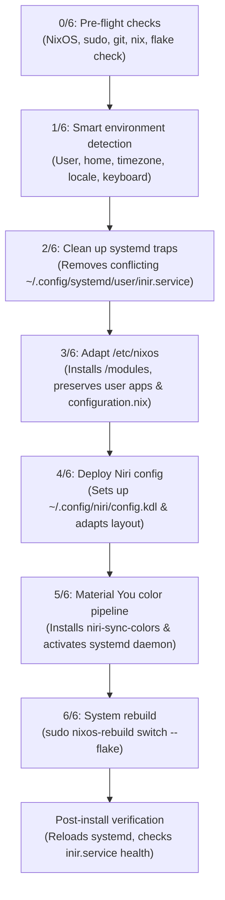

<div align="center">

# ❄️ iNiR on NixOS

<p>
  <b>English</b> |
  <b><a href="README.es.md">Español</a></b>
</p>

[](#-experimental-status-notice)
[](https://nixos.org)
[](https://github.com/YaLTeR/niri)
[](https://nixos.wiki/wiki/Flakes)
[](https://github.com/snowarch/iNiR)
[](https://github.com/snowarch/iNiR)


### A reproducible, modular NixOS guide and automated installer for running [iNiR](https://github.com/snowarch/iNiR) on the Niri Wayland compositor with Nix Flakes.

</div>

---

> [!WARNING]
> ### ⚠️ EXPERIMENTAL STATUS NOTICE
> This project and its automated installer (`install.sh`) are in an **experimental stage**.
> - The installer is designed to be **non-destructive**: it automatically creates timestamped backups (`.bak.<timestamp>`) before modifying any files.
> - It seamlessly adapts to your existing NixOS system without overwriting your applications, user accounts, or custom packages. However, it is strongly recommended to test first using `./install.sh --dry-run` on production setups.

---

## 📑 Table of Contents

- [Are Audio, Display Manager, and GNOME required?](#-faq-audio-desktop-and-requirements)
  - [Is Audio required? (`modules/audio.nix`)](#1-is-audio-required-modulesaudionix)
  - [Are GNOME or GDM required? (`modules/desktop.nix`)](#2-are-gnome-or-gdm-required-modulesdesktopnix)
- [How Does the Installer Script Work? (`install.sh`)](#-how-does-the-installer-script-work-installsh)
  - [Step-by-Step Execution Phases](#step-by-step-execution-phases)
  - [Installer CLI Options](#installer-cli-options)
- [Adapting to the User's Configuration](#-adapting-to-user-configuration)
- [Repository Structure — What Goes Where](#-repository-structure--what-goes-where)
- [Quick Start](#-quick-start)
  - [Option A — Automated Installer (Recommended)](#option-a--automated-installer-recommended)
  - [Option B — Manual Step-by-Step](#option-b--manual-step-by-step)
- [Dynamic Color Synchronization (Material You ↔ Niri)](#-color-sync--niri--wallpaper)
- [Niri Configuration & Keybinds](#-niri-configuration--keybinds)
- [Post-Install Verification & Diagnostics](#-post-install-verification)
- [Updating & Rollbacks](#-updating)
- [Troubleshooting & Known Gotchas](#-troubleshooting--known-gotchas)

---

## 💡 FAQ: Audio, Desktop, and Requirements

### 1. Is Audio required? (`modules/audio.nix`)
* **For the Niri compositor:** **No.** Niri can open windows, tile columns, and manage outputs without an audio daemon running.
* **For the iNiR desktop shell:** **Yes, for its interactive multimedia widgets.** The iNiR top bar and quick settings panel include:
  - System volume and microphone level sliders.
  - Interactive input/output audio sink switcher menus.
  - Media player widgets powered by MPRIS (`playerctl`).
  - System sound effects and screen recording audio mixing (`wf-recorder`).
* **What does `modules/audio.nix` do?** It configures PipeWire with PulseAudio emulation and 32-bit ALSA support.
* **How does it adapt to your configuration?** All directives use `lib.mkDefault`. **If you already have PipeWire or PulseAudio configured in your `/etc/nixos/configuration.nix`, NixOS will respect your configuration without collision.**
* **Can I disable it?** Yes. If you prefer to manage audio yourself or don't want PipeWire:
  ```nix
  programs.inir.audio.enable = false;
  ```

---

### 2. Are GNOME or GDM required? (`modules/desktop.nix`)
* **Is GNOME required? NO!** iNiR is a complete, standalone desktop shell written in QuickShell and Qt6. GNOME was originally included only as an emergency "fallback session", but downloading it pulled gigabytes of unnecessary packages. Therefore, **the GNOME fallback is DISABLED BY DEFAULT (`enableGnomeFallback = false`)**. It will never download GNOME unless you explicitly opt in.
* **Is GDM required?** GDM is merely a graphical display manager (login screen). When `programs.niri.enable = true` is active, Niri automatically installs a standard Wayland session desktop file (`niri.desktop`) that any display manager (GDM, SDDM, greetd/tuigreet, LightDM) recognizes immediately.
* **Can I disable GDM if I use another display manager or start from TTY?** Yes, simply set in your `configuration.nix`:
  ```nix
  programs.inir.desktop.enable = false;
  ```

---

## 🛠️ How Does the Installer Script Work? (`install.sh`)

`install.sh` automates the entire installation in a reproducible, declarative, and safe workflow spanning 7 sequential phases (0 to 6):



### Step-by-Step Execution Phases:

1. **Phase 0/6 — Pre-Flight Validation:**
   - Verifies running on NixOS (`/etc/nixos` present).
   - Validates essential installation prerequisites: `git`, `nix`, and `sudo`.
   - *Note:* Does not block on runtime dependencies (`inotifywait`, `jq`, `python3`) beforehand, as NixOS modules will deliver them during the system build.
   - Runs `nix flake check` on the repository to guarantee syntax correctness before making any changes.

2. **Phase 1/6 — Smart Environment & User Detection:**
   - Detects the target user account (resolves `$SUDO_USER` and their actual `$HOME` directory even if run with `sudo` to prevent writing to `/root`).
   - Reads hostname (`hostname`), timezone (`timedatectl`), system locale (`localectl`), and keyboard layout (`X11 Layout`).
   - If `/etc/nixos/configuration.nix` already defines these parameters, the installer extracts and respects them to maintain absolute consistency.
   - Prompts for interactive confirmation or allows custom overrides.

3. **Phase 2/6 — Systemd Trap Mitigation & Obsolete Service Cleanup:**
   - **Gotcha #1 Fix:** Running `inir doctor` upstream creates a static file at `~/.config/systemd/user/inir.service`. This static file silently overrides the NixOS declarative service in `/etc/systemd/user/inir.service`, causing runtime failures. The installer safely detects and removes it.
   - Cleans up legacy/stale services from previous versions (`niri-color-sync.service`, `xwayland-satellite.service`, obsolete cron timers).

4. **Phase 3/6 — System Configuration Adaptation (`/etc/nixos`):**
   - Creates a timestamped backup of `/etc/nixos/modules` and installs the fresh iNiR modules.
   - **If you have an existing `/etc/nixos/configuration.nix`:**
     - Creates a backup (`configuration.nix.bak.<timestamp>`).
     - **Preserves all your existing packages, applications, drives, and user accounts.**
     - Safely injects `./modules` into your `imports = [ ... ]` block.
     - Verifies whether your user is in the `video` and `i2c` groups (required for DDC/CI monitor brightness).
   - **If this is a fresh installation:**
     - Deploys the clean reference template substituted with your detected settings.
   - **Flake Configuration:**
     - If `/etc/nixos/flake.nix` exists, it verifies the `snowarch/inir` input.
     - If not, it installs the reference flake configured for your hostname.

5. **Phase 4/6 — Niri Compositor Configuration:**
   - Creates timestamped backups of `~/.config/niri/config.kdl` if already present.
   - Deploys the recommended Niri configuration and automatically adapts keyboard layout settings (`xkb { layout "..." }`) to match your detected keyboard layout.

6. **Phase 5/6 — Material You Dynamic Theming Pipeline:**
   - Installs `niri-sync-colors` to `~/.local/bin/`.
   - Installs and enables the `niri-sync-colors.service` user systemd daemon to synchronize borders and colors whenever you pick a wallpaper with <kbd>Mod</kbd> + <kbd>W</kbd>.

7. **Phase 6/6 — Declarative Rebuild (`nixos-rebuild switch`):**
   - Automatically detects the correct flake target (`/etc/nixos#<hostname>` or `/etc/nixos`).
   - Executes the rebuild and streams complete build logs to `/tmp/inir-nixos-install-<timestamp>.log`.
   - Reloads the user systemd daemon and restarts `inir.service` and `niri-sync-colors.service`.

---

### Installer CLI Options

| Flag | Description |
|---|---|
| `./install.sh` | Interactive mode with step-by-step confirmation prompts. |
| `./install.sh --yes` (`-y`) | Non-interactive mode: automatically answers yes to all prompts. |
| `./install.sh --dry-run` | Simulation mode: shows all commands and file operations without altering the system. |
| `./install.sh --skip-rebuild` | Deploys files, configs, and user services, but skips running `nixos-rebuild switch`. |
| `./install.sh --check` | Runs the non-destructive verification script `scripts/verify-setup.sh` and exits. |
| `./install.sh --help` (`-h`) | Displays CLI help and usage examples. |

---

## 🧩 Adapting to User Configuration

The modules are built around `lib.mkDefault` and declarative toggle options so they never fight your existing configuration.

### Configurable Module Options:

```nix
# In your /etc/nixos/configuration.nix:

{
  imports = [
    ./hardware-configuration.nix
    ./modules
  ];

  # --- iNiR Modular Options ---
  # Audio with PipeWire (enabled by default; uses lib.mkDefault to merge cleanly):
  programs.inir.audio.enable = true;

  # Display Manager (GDM) for login screen:
  programs.inir.desktop.enable = true;

  # GNOME emergency fallback (DISABLED by default to eliminate system bloat):
  programs.inir.desktop.enableGnomeFallback = false;

  # Ensure your user has 'video' and 'i2c' for DDC/CI external monitor brightness:
  users.users.your_user = {
    isNormalUser = true;
    extraGroups = [ "wheel" "networkmanager" "video" "i2c" ];
  };
}
```

---

## 🗺️ Repository Structure — What Goes Where

| In this repository | System Destination | Purpose |
|---|---|---|
| `configuration.nix` | `/etc/nixos/configuration.nix` | Base system config (imports `./hardware-configuration.nix` and `./modules`) |
| `flake.nix` | `/etc/nixos/flake.nix` | Flake pinning nixpkgs and upstream iNiR input |
| `modules/default.nix` | `/etc/nixos/modules/default.nix` | Module aggregator |
| `modules/inir.nix` | `/etc/nixos/modules/inir.nix` | Patched iNiR package, environment variables & tmpfiles symlinks |
| `modules/inir-deps.nix` | `/etc/nixos/modules/inir-deps.nix` | Runtime dependencies, Qt6/KDE frameworks, Python theming libraries |
| `modules/runtime.nix` | `/etc/nixos/modules/runtime.nix` | Flakes, nix-ld compatibility, `QT_PLUGIN_PATH` and `QML2_IMPORT_PATH` |
| `modules/fonts.nix` | `/etc/nixos/modules/fonts.nix` | Required UI fonts (`material-symbols`, JetBrains Mono Nerd Font, Roboto) |
| `modules/patches/` | `/etc/nixos/modules/patches/` | NixOS icon resolution patches and FHS path replacements |
| `modules/audio.nix` | `/etc/nixos/modules/audio.nix` | PipeWire server with PulseAudio emulation |
| `modules/desktop.nix` | `/etc/nixos/modules/desktop.nix` | GDM display manager integration (GNOME fallback optional) |
| `niri/config.kdl` | `~/.config/niri/config.kdl` | Niri compositor keybinds, layout, and focus-ring configuration |
| `scripts/niri-sync-colors` | `~/.local/bin/niri-sync-colors` | Watches generated palette and updates Niri focus-ring in real-time |
| `systemd/niri-sync-colors.service` | `~/.config/systemd/user/` | User systemd daemon running `niri-sync-colors --watch` |
| `scripts/verify-setup.sh` | Run locally | Diagnostic script checking dependencies, services, and permissions |
| `install.sh` | Run locally | Automated modular installer with backups and environment auto-detection |

---

## 🚀 Quick Start

### Option A — Automated Installer (Recommended)

Clone the repository and run the installer:

```bash
git clone https://github.com/LATAR-web/inir-nixos.git
cd inir-nixos
chmod +x install.sh
./install.sh
```

> [!TIP]
> Perform a test run without modifying any files:
> ```bash
> ./install.sh --dry-run
> ```

---

### Option B — Manual Step-by-Step

#### 1️⃣ Copy modules to `/etc/nixos`

```bash
sudo cp -a modules/ /etc/nixos/modules/
```

#### 2️⃣ Add `./modules` to your `configuration.nix`

Edit `/etc/nixos/configuration.nix` to include `./modules` in `imports`:

```nix
imports = [
  ./hardware-configuration.nix
  ./modules
];
```

Ensure your user has `video` and `i2c` groups:
```nix
users.users."your_user".extraGroups = [ "networkmanager" "wheel" "video" "i2c" ];
```

#### 3️⃣ Configure Flake inputs in `/etc/nixos/flake.nix`

Ensure your `flake.nix` defines the `inir` input and passes it through `specialArgs`:

```nix
inputs = {
  nixpkgs.url = "github:nixos/nixpkgs/nixos-unstable";
  inir = {
    url = "github:snowarch/inir";
    inputs.nixpkgs.follows = "nixpkgs";
  };
};

outputs = { self, nixpkgs, inir, ... }: {
  nixosConfigurations."your_hostname" = nixpkgs.lib.nixosSystem {
    system = "x86_64-linux";
    specialArgs = { inherit inir; };
    modules = [ ./configuration.nix ];
  };
};
```

#### 4️⃣ Build and Switch

```bash
cd /etc/nixos
sudo git add -A
sudo nixos-rebuild switch --flake /etc/nixos
```

#### 5️⃣ Install Niri Config & Color Sync Daemon

```bash
mkdir -p ~/.config/niri ~/.local/bin ~/.config/systemd/user

cp niri/config.kdl ~/.config/niri/config.kdl
cp scripts/niri-sync-colors ~/.local/bin/
chmod +x ~/.local/bin/niri-sync-colors
cp systemd/niri-sync-colors.service ~/.config/systemd/user/

systemctl --user daemon-reload
systemctl --user enable --now niri-sync-colors.service
```

---

## 🎨 Color Sync — Niri ↔ Wallpaper

iNiR generates dynamic Material You color schemes from your active wallpaper using `matugen` and a Python pipeline (`materialyoucolor`, `pillow`, `numpy`, `evdev`).

To synchronize these generated colors with the Niri compositor:
1. When you select a wallpaper with <kbd>Mod</kbd> + <kbd>W</kbd>, iNiR writes:
   - `~/.local/state/quickshell/user/generated/colors.json`
   - `~/.local/state/quickshell/user/generated/theme-meta.json`
2. The `niri-sync-colors` background service (`systemd/niri-sync-colors.service`) detects modifications via `inotifywait`.
3. It calls `niri-config.py` to update active and inactive `focus-ring` colors in `~/.config/niri/config.kdl` live.
4. It atomically updates the active wallpaper path in `~/.config/illogical-impulse/config.json`.

---

## ⌨️ Niri Configuration & Keybinds

Key shortcuts pre-configured in `niri/config.kdl`:

| Key | Action |
|---|---|
| <kbd>Mod</kbd> + <kbd>Return</kbd> | Open terminal (`alacritty`) |
| <kbd>Mod</kbd> + <kbd>W</kbd> | Wallpaper selector |
| <kbd>Mod</kbd> + <kbd>Space</kbd> | Toggle workspace overview |
| <kbd>Mod</kbd> + <kbd>V</kbd> | Clipboard history |
| <kbd>Mod</kbd> + <kbd>,</kbd> | iNiR settings |
| <kbd>Mod</kbd> + <kbd>/</kbd> | Cheatsheet overlay |
| <kbd>Mod</kbd> + <kbd>Shift</kbd> + <kbd>W</kbd> | Cycle panel style family |
| <kbd>Mod</kbd> + <kbd>Shift</kbd> + <kbd>S</kbd> | Region screenshot |
| <kbd>Mod</kbd> + <kbd>Shift</kbd> + <kbd>X</kbd> | Region OCR recognition |
| <kbd>Mod</kbd> + <kbd>E</kbd> | File manager |
| <kbd>Mod</kbd> + <kbd>B</kbd> | Web browser |
| <kbd>Mod</kbd> + <kbd>Alt</kbd> + <kbd>Space</kbd> | Switch keyboard layout |
| <kbd>Mod</kbd> + <kbd>Q</kbd> | Close window |
| <kbd>Mod</kbd> + <kbd>Shift</kbd> + <kbd>Q</kbd> | Quit Niri session |
| <kbd>Mod</kbd> + <kbd>F</kbd> | Toggle fullscreen |
| <kbd>Mod</kbd> + <kbd>1</kbd>–<kbd>5</kbd> | Focus workspace 1–5 |
| <kbd>Mod</kbd> + <kbd>Shift</kbd> + <kbd>1</kbd>–<kbd>5</kbd> | Move column to workspace 1–5 |

---

## ✅ Post-Install Verification

Run the diagnostic verification script at any time:

```bash
bash scripts/verify-setup.sh
```

Checks performed:
- Availability of required CLI tools (`niri`, `inir`, `python3`, `jq`, `inotifywait`, `cliphist`).
- Python `materialyoucolor` module import test.
- Active status of `inir.service` and `niri-sync-colors.service`.
- Niri configuration and clipboard watcher validation.

---

## 🔄 Updating

To update flake inputs and rebuild your system:

```bash
cd /etc/nixos
nix flake update
sudo nixos-rebuild switch --flake /etc/nixos
systemctl --user restart inir.service
```

Roll back instantly if an update causes issues:
```bash
sudo nixos-rebuild switch --rollback
```

---

## 🐛 Troubleshooting & Known Gotchas

| Issue | Cause & Solution |
|---|---|
| **Stray `inir.service` in user directory** | Running `inir doctor` creates `~/.config/systemd/user/inir.service`. This file overrides `/etc/systemd/user/inir.service` generated by NixOS and breaks declarative configuration. Remove it (`rm ~/.config/systemd/user/inir.service`). The installer cleans this automatically. |
| **Missing `/bin/cat`** | iNiR scripts rely on FHS `/bin/cat`. Fixed via `systemd.tmpfiles.rules = [ "L+ /bin/cat - - - - ${pkgs.coreutils}/bin/cat" ];` in `modules/inir.nix`. |
| **Missing Icons in QuickShell** | Upstream iNiR searches Arch `/usr/share/icons`. Fixed by `modules/patches/inir-icon-theme.patch` and symlinking `/run/current-system/sw/share/icons`. |
| **Brightness controls (DDC/CI) fail** | Make sure your user belongs to `video` and `i2c` groups, and `hardware.i2c.enable = true` is set in `modules/inir.nix`. |

---

<div align="center">

Made with ❄️ for NixOS and Niri

</div>
